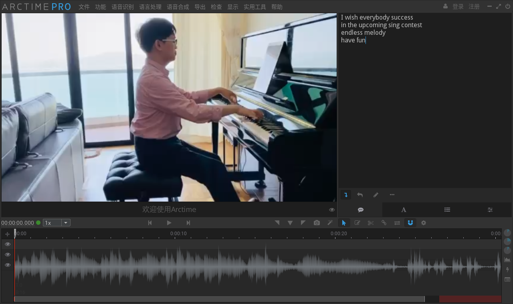
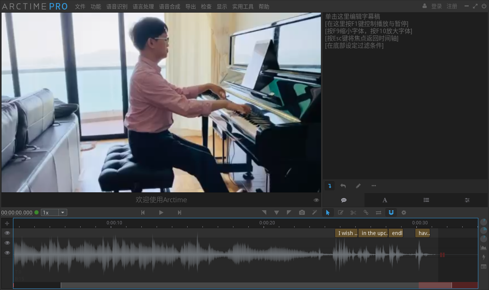

**此文档（网页）是声声不息亲友团视频指引**

last update: 10.24

# 任务分配和文件下载

|subcom|选手1|选手2|
|:---:|:---:|:---:|
|白天田|[魏圳楠1](./word/魏圳楠.docx)|[沈香雪10](./words/沈香雪.docx)|
|唐钰茜|[李佳阳3](./word/李佳阳姚帅宇.pdf)|[姚帅宇9](./word/李佳阳姚帅宇.pdf)|
|黄清华|[黄思敏7](./word/黄思敏.word)||
|成果|[唐婉彬8](./word/唐婉彬.docx)||
|吳雅欣|[郑天石5](./word/郑天石.docx)||
|曾语航|[刘畅2](./word/刘畅.docx)|[刘家乐6](./wrod/刘家乐)|
|赵柏霖|[黄嘉颖4](./word/黄嘉颖.docx)||

ddl: 11.2周二中午12：00

# 视频要求

选手总控组发来的word中下载每位选手录好的视频，根据选手总控的建议和自己的想法将视频剪在一起。

需要：

0. 看[例子](https://youtu.be/hwsw1oyrcm8)
1. 截取出有用的片段(word文档中应该已经标好了部分)
2. 全部配好字幕（繁体）
3. 连接在一起并加过场。

注：先截取出有用的片段（把前后废话笑场调整镜头的减掉），再配字幕，最后把所有视频连接在一起加过场

可以考虑加入一些文字连接，比如这是对哪个问题的回答：“你眼中的ta？”

[例子](https://youtu.be/hwsw1oyrcm8)

例子只做大致形式参考，请自行发挥。

# PR指引

0. "效果控件"（或说到的任何一个面板）在哪里？  
	在画面中**使劲找**，所有可能的箭头(>>)都点一点看看是不是被隐藏了，都没有就到最上面的"窗口"里面找到打开即可。[详细链接](http://www.winwin7.com/JC/19185.html)

1. 如何调整视频大小  
	先创建序列，创建时设置好参数，再拖入视频。 [详细链接](https://www.zhihu.com/question/267377976)

2. 如何裁剪视频画面  
	在"视频效果/视频特效"->"变换"->"裁剪"。随后在"效果控件"设置详细参数。[详细链接](https://jingyan.baidu.com/article/6c67b1d6aa12902787bb1ec5.html)

3. 如何截取视频片段/改变播放顺序  
	在时间轴直接拖动素材两端可以改变单个素材的起止时间；或使用"剃刀工具"/"ctrl+k快捷键"将单个素材分成多个，即可重新排列素材。[详细链接](https://jingyan.baidu.com/article/6fb756ec785437241858fb8c.html)

4. 被切开的素材怎么重新合并为一个（能方便统一加特效）  
	右键->重组。[详细链接](https://blog.csdn.net/qq_37591637/article/details/102641725)

5. 如何添加文字  
	在工具栏找到"文字工具"（和剃刀工具，选择工具在一起的），选择后在视频监视器那里点击加入文字，在"效果控件"可以调整字体大小颜色等。[详细链接](https://zhidao.baidu.com/question/14776117)

6. 如何添加过场和简单特效  
	找到"效果"窗口，过场类画面在"视频过渡"，简单特效在"视频效果"。[详细链接](https://jingyan.baidu.com/article/6b182309810c95ba58e15929.html)


# 字幕指引

## 软件介绍
ArcTime是很小巧方便的字幕制作软件。有Windows，Mac，Linux发行版。  
[点此链接下载](https://arctime.org/download.html)，或复制以下网址
https://arctime.org/download.html

## 使用指南  
1. 将字幕提前写好，按照每句话分行（即一行文字会同时显示）
2. 将字幕复制到右上字幕框中
3. 使用快速拖拽创建工具/JK拍打工具 参照下方的语音波形图，边播放边放置字幕块
4. 具体可见[官方快速上手指南](https://arctime.org/quick-start-guide.html) 和[官方六分钟上手视频教程](https://arctime.org/guide.html)

### 举例  
1. 将字幕提前写好，按照每句话分行（即一行文字会同时显示）
	```plain
	I wish everybody success
	in the upcoming sing contest
	endless melody
	have fun
	```
2. 将字幕复制到右上字幕框中
	

3. 使用快速拖拽创建工具/JK拍打工具 参照下方的语音波形图，边播放边放置字幕块
	

## 导出字幕、工程文件、压制视频
1. 选择上方 "导出"->"字幕文件"，选择导出SRT，其他默认
2. 选择上方 "文件"->"工程文件另存为"
3. 选择上方 "导出"->"快速视频压制（标准MP4）" CRF选18，preset选6


# 提交
## 提交文件要求：

每名选手有id

x 为这名选手的第几个视频

|文件|命名|
|:---:|:---:|
|源视频文件|id_o_x.\*|
|加字幕并截取后文件|id_x.mp4|
|字幕文件|id_x.srt|
|工程文件|id_x.atpj|
|加好过场的完整视频|id.mp4|
|打包以上全部|id.zip|

将id.zip发送给负责人邮箱，邮件主题为“声声不息亲友团视频(id)”
zzhangfc@connect.ust.hk
